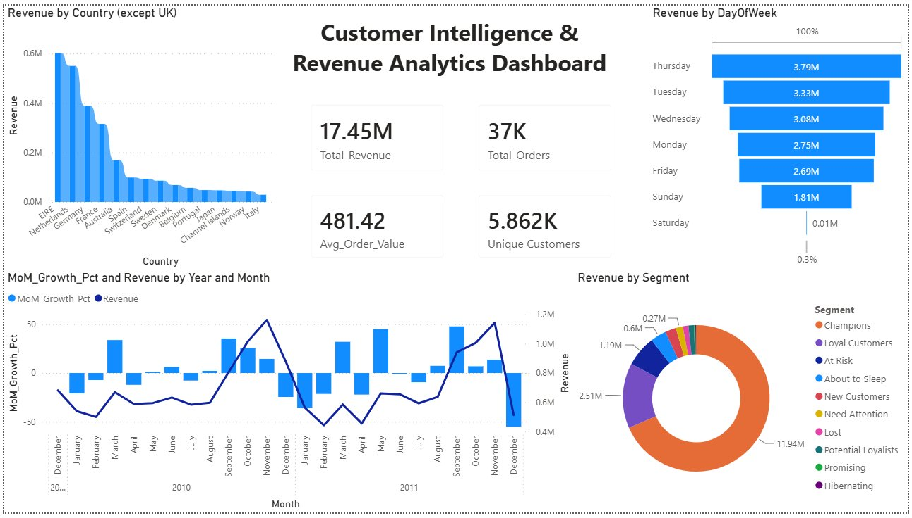

# Customer Intelligence & Revenue Analytics
`Python` · `MySQL` · `pandas` · `matplotlib` · `Power BI` · `RFM Segmentation` · `Cohort Analysis`

---

## Executive Summary

Analysed **802,932 real transactions (£17.5M revenue)** from a UK-based online retailer across 41 countries using a 4-module analytics pipeline. Identified that **22% of customers (Champions) drive 68.4% of revenue**, M+1 retention sits at a critical **21%**, and international markets grew **8.1% YoY** while domestic declined 6.6%. Delivered 6 prioritised business recommendations with quantified revenue impact across segmentation, retention, product, and market intelligence.

---

## The Problem

Retailers with large transaction histories typically have no structured view of which customers are most valuable, when customers churn, which products drive revenue, and where international growth is hiding. Without this, marketing spend is undifferentiated, at-risk customers go undetected, and growth decisions are made on intuition rather than data.

The challenge: build an end-to-end analytics pipeline that cleans raw transactional data, segments the customer base by behaviour, quantifies cohort retention, and surfaces prioritised business recommendations — replicating the analytical workflow of a Business or Growth Analyst at a data-driven company.

---

## Dataset

**UCI Online Retail II** — Real commercial transaction data from a UK-based gift-ware retailer (Dec 2009 – Dec 2011).
Download `online_retail_II.csv` and place in `data/` before running.
> [Download from Kaggle](https://www.kaggle.com/datasets/mashlyn/online-retail-ii-uci) · Chen, D. (2012). UCI ML Repository. https://doi.org/10.24432/C5CG6D · CC BY 4.0

---

## The Solution — 4-Module Analytics Pipeline

| Input | Description |
|-------|-------------|
| `online_retail_II.csv` | 1,067,371 raw transactions — invoice, product, quantity, price, customer, country |
| `cleaned_transactions.csv` | 802,932 validated rows after quality pipeline |
| `cancelled_transactions.csv` | 19,494 cancelled invoices separated during cleaning |
| `rfm_segments.csv` | Customer-level RFM scores and segment labels |

```
RAW DATA (1,067,371 rows)
│
├── Module 1: Data Cleaning
│     Separate cancellations (19,494) · Drop missing Customer IDs (242,257)
│     Filter invalid qty/price · Derive Revenue, YearMonth, DayOfWeek, Hour
│     Output: 802,932 clean rows + cancelled_transactions.csv
│
├── Module 2: RFM Segmentation
│     Score every customer 1–5 on Recency, Frequency, Monetary
│     Assign 10 named segments (Champions to Lost)
│     Output: rfm_segments.csv (5,862 customers)
│
├── Module 3: Cohort Retention
│     Build monthly cohort matrix — % of customers active N months post-acquisition
│     Plot retention heatmap + average retention curve
│     Output: cohort_retention_matrix.csv + 2 charts
│
└── Module 4: MySQL Analytics (7 queries)
      Q1 Monthly Revenue + MoM Growth    · LAG() OVER()
      Q2 Country Performance (ex-UK)     · RANK(), DENSE_RANK()
      Q3 Top 20 Products by Revenue      · NTILE(4), RANK()
      Q4 Customer LTV Ranking            · PERCENT_RANK(), multi-table JOIN
      Q5 Peak Trading Hours              · RANK() OVER (PARTITION BY DayOfWeek)
      Q7 RFM Segment Summary             · SUM() OVER() for inline revenue share
      Q8 YoY Growth: UK vs International · Conditional aggregation, float cast
      Output: q1–q8 result CSVs

Note: UK excluded from Q2 — at £14M it dwarfs all international markets.
UK vs International comparison is handled separately in Q8.
```

---

## Dashboard

*Built with Power BI — using query result CSVs exported from the MySQL analytics pipeline.*



> Supporting chart exports (revenue trend, cohort heatmap, RFM distribution, country performance, peak hours, top products): [`outputs/`](outputs/)

---

## Results

| Module | Output | Key Finding |
|--------|--------|-------------|
| RFM Segmentation | 10 segments, 5,862 customers | Champions (22% of base) = 68.4% of revenue |
| Cohort Retention | 24-month matrix | M+1 retention = 21% — 79% of new customers lost after first purchase |
| Market Intelligence | UK vs 40 international markets | International +8.1% YoY vs UK -6.6% YoY |
| Product Analysis | Top 20 SKUs by revenue | REGENCY CAKESTAND alone: £286K from 3,317 orders |

Champions (1,297 customers) generated £11.9M. At Risk + About to Sleep segments hold £1.79M in recoverable revenue. Netherlands delivers £24,998 revenue per customer — consistent with a wholesale buyer profile.

---

## Business Questions & Answers

Real business questions this analysis is designed to answer — with findings drawn directly from the data.

**Q1. Which customer segment is most at risk of churning and what is the revenue impact?**

At Risk customers (551 customers, avg 302 days inactive) represent £1.19M in historical revenue. About to Sleep (466 customers, avg 512 days inactive) adds a further £603K. Combined, £1.79M in revenue is at risk of permanent loss within the next 1–2 purchase cycles if no intervention is made.

**Q2. Which international market should be prioritised for B2B sales investment?**

Netherlands delivers £24,998 revenue per customer across just 22 accounts — the highest revenue-per-customer of any market outside EIRE. EIRE generates £120,412 per customer from only 5 accounts. Both profiles are consistent with wholesale buyers, making them the highest-priority targets for a structured B2B sales motion with volume pricing and annual contracts.

**Q3. If only one win-back campaign could be run this month, which segment and what is the projected return?**

At Risk segment. These 551 customers have purchased before (avg 5.3 orders each) and their inactivity is recent enough to be recoverable. At an average spend of £2,165 per customer, a 15% reactivation rate returns approximately £179K in revenue from a single campaign.

**Q4. Which products are driving repeat purchases versus one-time buys?**

REGENCY CAKESTAND 3 TIER leads with 3,317 orders across 1,314 unique customers — a repeat purchase rate of 2.5 orders per customer. WHITE HANGING HEART T-LIGHT HOLDER shows 4,888 orders from 1,490 customers. Both are high-frequency, broad-reach SKUs that anchor the repeat purchase funnel and should be prioritised for inventory protection and bundle strategies.

**Q5. What is the revenue impact of improving M+1 retention by 5 percentage points?**

Current M+1 retention is 21%. A 5-point improvement to 26% retains approximately 23 additional customers per cohort. At an average new customer spend of £929, that is approximately £21K per cohort. Across 12 monthly cohorts, the annualised impact is approximately £252K in additional retained revenue — before any upsell or repeat purchase effect.

---

## Recommendations

**Rec 1 — Champions Retention Programme**
Assign dedicated account management to top 100 customers by LTV and set automated frequency-drop alerts to protect the segment driving 68.4% of total revenue.

**Rec 2 — M+1 Re-Engagement Sequence**
Deploy a 30-day post-purchase email sequence (day 7, 14, 28) with category-matched offers to recover approximately 290 additional retained customers per cohort from a 5-point retention improvement.

**Rec 3 — At Risk Win-Back Campaign**
Run a time-limited win-back campaign for 551 At Risk and 466 About to Sleep customers before they cross into Lost, targeting a 15% reactivation rate to recover approximately £179K.

**Rec 4 — International B2B Sales Motion**
Assign structured B2B coverage to EIRE and Netherlands wholesale accounts with volume pricing, annual contracts, and preferred SLAs to accelerate international growth beyond 8.1% YoY.

**Rec 5 — Campaign Scheduling to Peak Window**
Schedule all campaigns to land by 09:30 Tuesday or Wednesday, aligning to Wednesday 12:00 — the single highest-revenue hour at £545,977.

**Rec 6 — Tier 1 SKU Inventory Protection**
Classify top 20 SKUs as Tier 1 with dedicated inventory buffers and automated reorder triggers at 30% stock remaining to prevent stockout-driven revenue loss.

| Recommendation | Revenue at Stake | Expected Outcome |
|---------------|-----------------|-----------------|
| Champions Retention | £11,937,871 base | Risk protection |
| M+1 Re-Engagement | ~290 customers/cohort | +5pp M+1 retention |
| At Risk Win-Back | £1,795,009 recoverable | ~£179K recovered |
| International B2B | £1,320,495 intl base | +12-15% YoY growth |
| Campaign Scheduling | All segments | Engagement uplift |
| Tier 1 SKU Protection | 28% of £17.5M | Stockout prevention |

> For detailed findings behind each recommendation: [insights_report.md](insights_report.md)

---

## Skills Demonstrated

**Python** — multi-stage data cleaning pipeline, vectorised pandas operations, `qcut` RFM scoring with rank-based tie-breaking, cohort pivot matrix construction, matplotlib multi-panel charts with twin axes and custom colormaps

**MySQL** — `LAG() OVER()` for MoM growth · `RANK()` and `DENSE_RANK()` for market leaderboards · `PERCENT_RANK()` for LTV percentile positioning · `RANK() OVER (PARTITION BY DayOfWeek)` for within-day hour ranking · `SUM() OVER()` for inline revenue share without subquery · conditional aggregation for YoY pivots · `* 1.0` float casting to prevent integer division truncation · composite indexes on CustomerID, Country, YearMonth

**Business Analysis** — RFM framework implementation, monthly cohort retention modelling, customer lifetime value ranking, international market benchmarking, peak trading pattern analysis, executive insight report with 6 prioritised recommendations and quantified revenue impact

---

## Project Structure

```
Customer-Intelligence-and-Revenue-Analytics/
├── README.md
├── insights_report.md
│
├── data/
│   ├── online_retail_II.csv               <- download from Kaggle (not in repo)
│   ├── cleaned_transactions.csv
│   ├── cancelled_transactions.csv
│   ├── rfm_segments.csv
│   └── cohort_retention_matrix.csv
│
├── scripts/
│   ├── 00_mysql_setup.sql                 <- create DB schema + indexes
│   ├── 01_data_cleaning.py
│   ├── 02_rfm_segmentation.py
│   ├── 03_cohort_retention.py
│   ├── 04_load_mysql.py                   <- batch load into MySQL
│   ├── 05_mysql_analytics.sql             <- 7 MySQL business queries
│   ├── 05_run_analytics.py
│   └── 06_executive_dashboard.py
│
└── outputs/
    ├── power_bi_dashboard.png
    ├── chart_revenue_trend.png
    ├── chart_country_performance.png
    ├── chart_peak_hours_heatmap.png
    ├── chart_top_products.png
    ├── cohort_retention_heatmap.png
    ├── cohort_avg_retention_curve.png
    ├── rfm_segment_distribution.png
    ├── rfm_revenue_by_segment.png
    └── q1_monthly_revenue.csv ... q8_yoy_growth.csv
```

---

## Setup

```bash
pip install pandas matplotlib seaborn openpyxl mysql-connector-python

python scripts/01_data_cleaning.py
python scripts/02_rfm_segmentation.py
python scripts/03_cohort_retention.py

mysql -u root -p < scripts/00_mysql_setup.sql
python scripts/04_load_mysql.py --host localhost --user root --password yourpassword

mysql -u root -p retail_analytics < scripts/05_mysql_analytics.sql
python scripts/05_run_analytics.py
python scripts/06_executive_dashboard.py
```

*Tools: Python 3.x · MySQL 8.0 · pandas · matplotlib · seaborn · Power BI*
